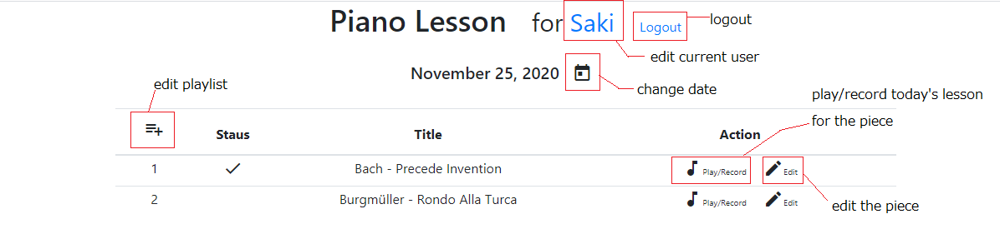
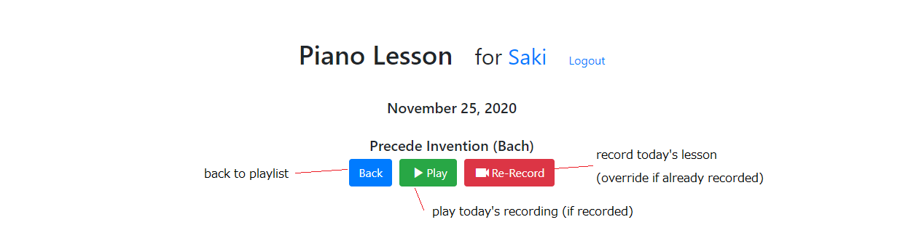
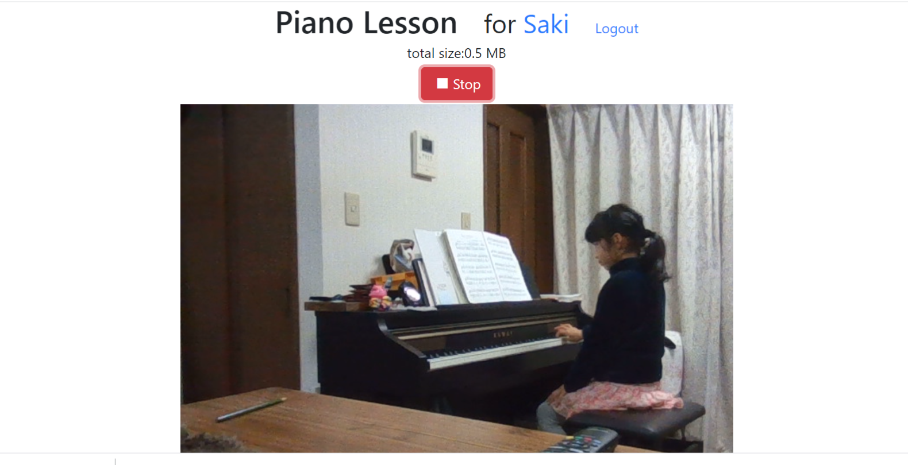
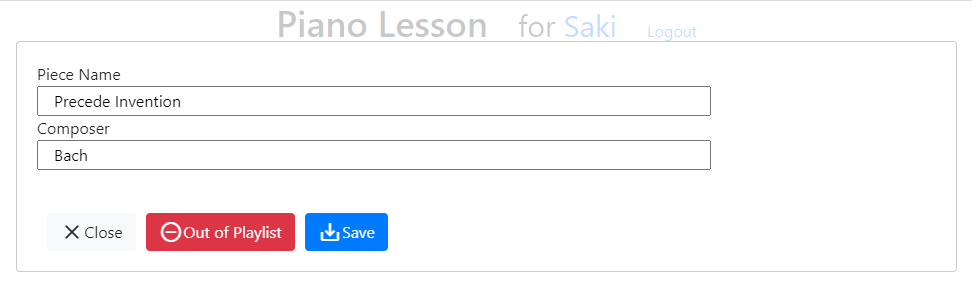
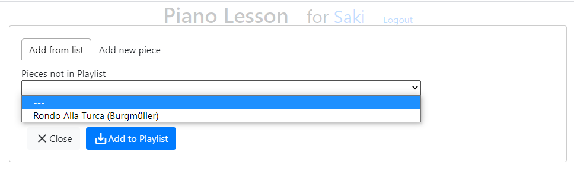
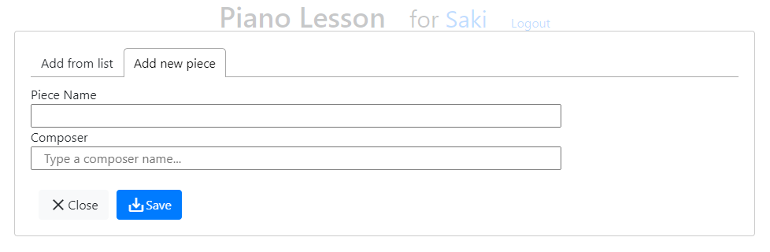
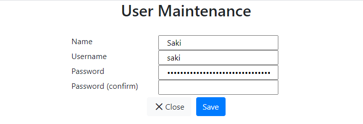

# Piano Lesson

---

## MuleSoft Self-contained WebSocket Application

This is a websocket application which captures video and directly save it in AWS S3 bucket, and which runs on MuleSoft CloudHub.

---

## Setup

### Requirement

- CloudHub Runtime worker x 1 (free 30days trial environment is enough)
- AWS S3 bucket x 1
- AWS IAM User & credentials x 1

### Steps

1. Preparation - AWS S3 bucket setup
2. MuleSoft Runtime application deployment
3. Post-Deployment operation

That's it! No other deployment/setup required!

### Preparation - AWS S3 bucket setup

Create a S3 bucket and an IAM user, then grant the following previledges to the user for the bucket:

- S3:PutObject
- S3:GetObject
- S3:ListBucketMultipartUploads
- S3:AbortMultipartUpload
- S3:ListBucket
- S3:ListMultipartUploadParts

Policy example in JSON format:

```json:aws-ploicy
{
    "Version": "2012-10-17",
    "Statement": [
        {
            "Sid": "VisualEditor0",
            "Effect": "Allow",
            "Action": [
                "s3:PutObject",
                "s3:GetObject",
                "s3:ListBucketMultipartUploads",
                "s3:AbortMultipartUpload",
                "s3:ListBucket",
                "s3:ListMultipartUploadParts"
            ],
            "Resource": [
                "arn:aws:s3:::skd-piano-lesson",
                "arn:aws:s3:::skd-piano-lesson/*"
            ]
        }
    ]
}
```

### MuleSoft Runtime application deployment

"mulesoft" folder is the Anypoint Studio project to deploy. Deploy the project with the following system properties:

- hostname=\<hostname(e.g. mule-worker-mule-worker-skd-piano-lesson.us-e2.cloudhub.io)\>
  - if you use an environemnt without Dedicated Load Balancer (like 30days free trial environment), you need to use hostname with "mule-worker-" as prefix to directly access to your worker
- websocket.protocol=wss
- websocket.port=8082
  - if you use an environemnt without Dedicated Load Balancer (like 30days free trial environment), you need to use port 8082 to directly access to your worker
- aws.s3.region=\<AWS regtion (e.g. ap-northeast-1)\>
- aws.s3.bucket_name=\<AWS S3 Bucket Name (e.g. skd-piano-lesson)\>
- aws.s3.accessKeyId=\<AWS IAM User Access Key\>
- aws.s3.secretAccessKey=\<AWS IAM User Secret Access Key\>

If you have Dedicated Load Balancer (DLB), set up DLB as following and use normal hostname/port:
[https://docs.mulesoft.com/websockets-connector/1.0/websockets-connector-cloudhub](https://docs.mulesoft.com/websockets-connector/1.0/websockets-connector-cloudhub)

### Post-Deployment operation

To create an admin user, execute "skd-piano-lesson-initFlow_Scheduler" from RUntime Manager. This will create an user "Admin" with **username/password = admin/admin**

---

## Operation Manual

### Notice

If you deploy it to an environment without "Dedicated Load Balancer" (like 30days free trial environment), you have to use hostname with "mule-worker-" as prefix and port number "8082" to directly asscess to your worker like:
[https://mule-worker-skd-piano-lesson.us-e2.cloudhub.io:8082/login](https://mule-worker-skd-piano-lesson.us-e2.cloudhub.io:8082/login)

And, this document assumes that you use 30days free trial environment.

And this implementation doesn't work on iOS safari (at least). Please use PC/Mac.

### Login

Access to "https://mule-worker-\<hostname\>:8082/login". If you executed  "skd-piano-lesson-initFlow_Scheduler" scheduler from Runtime Manager, "Admin" user is already created. Use "admin" as username, "admin" as password to login.


### Playlist

After login, you will be led to the "Playlist" page. On this page, you can edit the playlist, select a piece to play/record it for today, edit a piece information, select a date to play past recordings.



### Lesson

When you click "Play/Record" button on Playlist page, you will be led to the "Lesson" page. 
On this page, you can open player to play today's lesson for the piece (if recorded) by clicking "Play" button. If not recorded yet, "Play" button will not be displayed.
By clicking "Record" button (if recorded, "Re-Record" button), you can open recorder to record (or override) today's lesson for the piece.



### Recording

When you click "Record"/"Re-Record" button on Lesson page, you will be led to "Recording" page. If this is the first time for the browser, it will ask you to permit camera/audio access, so grant it. At this moment, video is NOT recorded YET. Adjust your camera and get ready for the play.
Once you're ready, click "Record" button, so that recording will start.
Once you're done, click "Stop" button to stop the recording and **WAIT FOR THE PAGE TRANSISION** to Lesson page.



### Play

When you click "Play" button on Lesson page, you will be led to "Play" page. The recording will be automatically played, but the buffering is very small so you can not change time-index (once you play all, you can chenge the time-index).

### Edit Piece

When you click "Edit" button on a piece in the Playlist page, "Edit Piece" popup will be displayed.
By changing Piece Name and/or Composer and clicking "Save" button, you can edit the piece information.
By clicking "Out of Playlist" button, you can remove the piece out of the playlist. This action doesn't actually delete the piece, just remove it from the list. You can get it in the playlist again from "Edit Playlist" page.



### Edit Playlist

When you click "Edit Playlist" icon (llist +) on the Playlist page, "Edit Playlist" popup will be displayed. There are 2 tabs.

#### Add from list

You can add pieces which you "remove out from the list" on Edit Piece popup into the playlist. Just select a piece from the list and click "Add to Playlist" button.



#### Add new piece

You can add a new piece. Enter Piiece Name and Composer, then click "Save" button.
Composer field will show you suggestions which are list of composers in the existing pieces. You can select a suggested composer or newly enter composer.



### Edit the Current User

When you click login user name on header section in any page, you can edit the login user information. Change Name, Username, or password.
Please note that you always have to enter "Password" and "Password (confirm)", otherwise you can not save.
Prefilled password is encrypted, so you always have to enter (non-encrypted) "Password" even though something looks prefilled.



### Create User

As long as you login (and session is not expired), you can add a user by accessing URL "https://mule-worker-\<hostname\>:8082/login/login.html#/user". There is no link to this page, so please enter this URL to your browser directly.

---

## Development

### Requirement for Development

- Node.js and IDE (This package.json assumes Visual Studio Code on Windows)
- Anypoint Studio

### Build

This repository represents Node.js project with React, and "mulesoft" folder is Anypoint Studio project. 
In the root folder, execute "npm run build" to build the application, and this will copy "dist/index.*" to "mulesoft/src/main/resources" and "dist/login.*" to "mulesoft/src/main/resources/login". Then deploy "mulesoft" folder to MuleSoft environment by Anypoint Studio deployment function.

- "build" uses "xcopy" command, but if you are not on Windows environment, change it to proper copy command.
